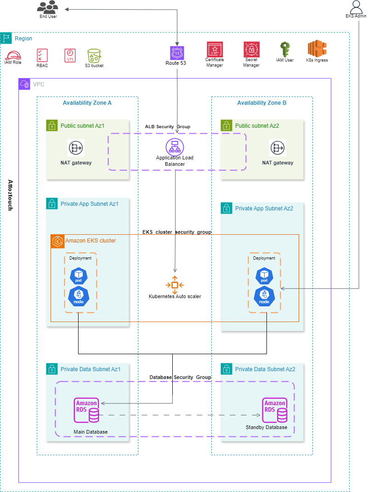

## DevOps Project: Deploying a Microservice Architecture on AWS with Kubernetes and EKS

### Overview
This project demonstrates how to host a dynamic web application on AWS using Kubernetes and Elastic Kubernetes Service (EKS). The infrastructure is designed to be robust, secure, and scalable, utilizing a variety of AWS services and resources.

### Architecture Diagram

### Project Components
1. **Virtual Private Cloud (VPC)**
   - Configured a VPC with both public and private subnets across two different availability zones for high availability and fault tolerance.

2. **Internet Gateway**
   - Deployed an Internet Gateway to enable VPC instances to connect to the internet.

3. **Security Groups**
   - Established Security Groups to act as network firewalls, controlling inbound and outbound traffic to VPC instances.

4. **Availability Zones**
   - Utilized two Availability Zones to ensure system reliability and fault tolerance.

5. **Public Subnets**
   - Used public subnets for infrastructure components such as the NAT Gateway and Application Load Balancer.

6. **MySQL RDS Instance**
   - Set up a MySQL RDS instance to manage the application database.

7. **Bastion Host**
   - Deployed a Bastion host in the public subnet using an EC2 instance for secure database migration to the RDS instance via Flyway.

8. **S3 Bucket**
   - Created an S3 bucket to store environment files.

9. **IAM Role with S3 Access**
   - Created an IAM role with the necessary permissions to access the S3 bucket.

10. **AWS Secrets Manager**
    - Stored environment variables securely using AWS Secrets Manager.
    - Created access policies for Secrets Manager.

11. **EKS Cluster**
    - Created an IAM role for the EKS cluster and set up the EKS cluster.

12. **RDS Security Group**
    - Modified the RDS security group to allow traffic only from the EKS security group.

13. **Worker Nodes**
    - Created an IAM role for worker nodes and added a node group to the EKS cluster to manage the worker nodes.

14. **EKS Manifest Files**
    - Developed EKS manifest files for service and deployment configurations.

15. **kubectl Configuration**
    - Configured `kubectl` to interact with the EKS cluster.

16. **Namespace Creation**
    - Created a namespace within the EKS cluster for the application.

17. **IAM OIDC Identity Provider**
    - Set up the IAM OIDC identity provider for the EKS cluster.

18. **AWS IAM Role for Service Account**
    - Created an IAM role for the Kubernetes service account.

19. **Load Balancer Controller**
    - Deployed the AWS Load Balancer Controller within the EKS cluster.

20. **Kubernetes Service Account**
    - Created a Kubernetes service account with the necessary permissions.

21. **Service, Deployment, and Ingress**
    - Developed and deployed Kubernetes manifest files for service, deployment, and ingress resources.

22. **Kubernetes Autoscaler**
    - Configured the Kubernetes autoscaler for dynamic scaling of application instances.

23. **SSL Certificate**
    - Acquired and configured an SSL certificate to encrypt communication.

24. **Route 53 Record Set**
    - Created a DNS record set in Route 53 for domain name resolution.

### Deployment Instructions
1. **Set Up VPC**
   - Create a VPC with public and private subnets across two availability zones.

2. **Deploy Internet Gateway**
   - Attach an Internet Gateway to the VPC.

3. **Configure Security Groups**
   - Create security groups for VPC instances and configure the necessary inbound and outbound rules.

4. **Set Up RDS Instance**
   - Launch a MySQL RDS instance within the private subnet.

5. **Deploy Bastion Host**
   - Create an EC2 instance in the public subnet to serve as a Bastion host.

6. **Create S3 Bucket and IAM Role**
   - Create an S3 bucket and an IAM role with access to the bucket.

7. **Store Environment Variables in Secrets Manager**
   - Use AWS Secrets Manager to securely store environment variables.

8. **Set Up EKS Cluster**
   - Create an IAM role for EKS and set up the EKS cluster.

9. **Configure RDS Security Group**
   - Update the RDS security group to allow traffic from the EKS security group.

10. **Create Worker Nodes and Node Group**
    - Set up an IAM role for worker nodes and add a node group to the EKS cluster.

11. **Develop EKS Manifest Files**
    - Write and apply manifest files for services, deployments, and ingress resources.

12. **Configure `kubectl`**
    - Set up `kubectl` to interact with the EKS cluster.

13. **Create Namespace**
    - Create a namespace in the EKS cluster for the application.

14. **Set Up IAM OIDC and Service Account**
    - Configure the IAM OIDC provider and create an IAM role for the Kubernetes service account.

15. **Deploy Load Balancer Controller**
    - Install and configure the AWS Load Balancer Controller in the EKS cluster.

16. **Create SSL Certificate**
    - Obtain and configure an SSL certificate for secure communication.

17. **Configure Route 53**
    - Create a DNS record set in Route 53 for your application's domain name.

### Conclusion
This project provides a comprehensive guide to deploying a dynamic web application on AWS using Kubernetes and EKS. By following these steps, you can ensure a secure, scalable, and highly available application deployment.

---

### Additional Resources
- [AWS VPC Documentation](https://docs.aws.amazon.com/vpc/index.html)
- [Amazon EKS User Guide](https://docs.aws.amazon.com/eks/latest/userguide/what-is-eks.html)
- [AWS Secrets Manager Documentation](https://docs.aws.amazon.com/secretsmanager/latest/userguide/intro.html)
- [Kubernetes Documentation](https://kubernetes.io/docs/home/)
